
 
  
    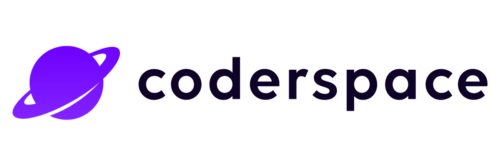

<h1 align="center"> IBTech Java Developer Bootcamp </h1>
<h3 align="center"> Final Project E-Commerce System </h3>  

 

 
  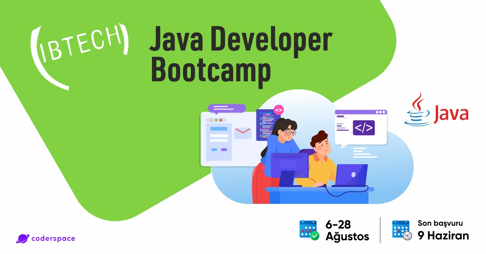

<!-- TABLE OF CONTENTS -->
<h2 id="table-of-contents"> :book: İçerik</h2>

  
İçerik

  <ol>
    <li><a href="#hakkinda"> ➤ Proje Hakkında</a></li>
    <li><a href="#prod"> ➤ Web Sitesi (Production)</a></li>
    <li><a href="#onemli"> ➤ Önemli Not ve Environment Değişkenleri</a></li>
    <li><a href="#teknolojiler"> ➤ Kullanılan Teknolojiler</a></li>
    <li><a href="#kurulum"> ➤ Kurulum</a></li>
    <li><a href="#klasor-yapisi"> ➤ Klasör Yapısı</a></li>
    <li><a href="#endpoint"> ➤ Endpointler</a></li>
    <li><a href="#postman"> ➤ Postman ve API Koleksiyonu</a></li>
    <li><a href="#mail"> ➤ Mail Gönderimi</a></li>  
    <li><a href="#loglama"> ➤ Loglama Mekanizması Ekran Görüntüsü</a></li>
    <li><a href="#front"> ➤ Frontend Ekran Görüntüsü</a></li>
    <li><a href="#gelistirme"> ➤ Bootcamp Hakkında</a></li>
    <li><a href="#iletisim"> ➤ İletişim ve Bilgiler</a></li>
  </ol>

<b>Backend Projesi Canlı Ortam:</b> <a href="https://ibtech-bootcamp.herokuapp.com/">https://ibtech-bootcamp.herokuapp.com/</a>  

<b>Bootcamp Proje & Ödevler Repo:</b> <a href="https://github.com/byofficial/ibtech-java-developer-bootcamp">https://github.com/byofficial/ibtech-java-developer-bootcamp</a>  

<!-- ABOUT THE PROJECT -->
<h2 id="prod"> :pencil: Web Sitesi (Production)</h2>

 
<b><a href="https://ibtech-bootcamp.herokuapp.com/">https://ibtech-bootcamp.herokuapp.com/</a>:</b>
Yukarıdaki web sitesi üzerinden canlı web sitesini test edebilirsiniz. Varsayılan kullanıcı bilgileri aşağıdadır. Sunucu
heroku server olduğu için yavaş çalışmaktadır. İşlemlerinizi gerçekleştirirken lütfen tamamlanmasını bekleyin.  

 
<b><u>Demo Kullanıcı Bilgileri:</u></b> 
<b>Kullanıcı Adı:</b> demo 
<b>Parola:</b> demo

<!-- ABOUT THE PROJECT -->
<h2 id="hakkinda"> :pencil: Proje Hakkında</h2>

 
<b>Proje Konusu:</b>
Java Servlet Webapp ve PostgreSQL kullanılarak e-ticaret sitesi yapılması. Kullanıcılar sisteme kayıt olup
ürün ve kategorilerde gezebilecektir. Dilediği ürünü sepetine ekler ve daha sonra sipariş verebilir.  

<!-- ABOUT THE PROJECT -->
<h2 id="onemli"> :pencil: Önemli Not ve Environment Değişkenleri</h2>

 
Projeyi lokalinize indirip test ederken mutlaka ilgili IDE'nize <b>Environment Variable</b> eklemeliniz 
gerekmektedir. Aşağıdaki isimlerde environment variable oluşturmalısınız.

      SITE_URL: <#Site adını yazın# Örn: localhost:8080/>
      SITE_MODE: <#Site bakım veya normal mod, normal=0, bakım=0# Örn: 0>
      
      MAIL_HOST: <#SMTP mail host# Örn: mail.alanadi.com>
      MAIL_FROM: <#Gönderici mail adresi# Örn: from@alanadi.com>
      MAIL_USER: <#SMTP kullanıcı adı# Örn: mail@alanadi.com>
      MAIL_PASS: <#SMTP kullanıcı parolası# Örn: 12345>
      MAIL_PORT: <#SMTP port# Örn: 587>
      
      DB_DRIVER: <#Veritabanı driver# Örn: org.postgresql.Driver>
      DB_URL: <#Veritabanı host+url+port# Örn: jdbc:postgresql://localhost:5342/dbdemo>
      DB_USER: <#Veritabanı kullanıcı adı# Örn: postgres>
      DB_PASSWORD: <#Veritabanı parola# Örn: root>
     
      CLOUDINARY_CLOUD_NAME: <#Cloudinary cloud adı# Örn: XXXX>
      CLOUDINARY_API_KEY: <#Cloudinary api key# Örn: XXXXX>
      CLOUDINARY_API_SECRET: <#Cloudinary secret key# Örn: XXXXX>

Yukarıdaki her bir değişlken adı için kullandığınız IDE ortamında environment variables oluşturmanız gerekmektedir.
Buradaki değişkenlerin her birini kod içerisinde System.getenv() metodu ile çekilmektedir. Tüm değişkenler güvenlik
nedeniyle bu şekilde belirtilmiştir.

<!-- PREREQUISITES -->
<h2 id="teknolojiler"> :fork_and_knife: Kullanılan Teknolojiler</h2>

  
  
  

<!--This project is written in Python programming language.  -->
Projede kullanılan diğer teknolojiler:

* Java 8
* Maven
* PostgreSQL 14
* Heroku Server Deployment
* Cloudinary Image CDN Service
* Servlet Web App
* SMTP Mail Service
* Javax Mail Service
* Webapp-Runner Deployment
* Bootstrap 4.5.1
* JDBC
* Tomcat 9

<!-- PREPROCESSING -->
<h2 id="kurulum"> :hammer: Kurulum</h2>

 
Projeyi lokal suncunuza kurmak için  Github reposundan indirebilirsiniz.

<h2 id="on-bilgiler"> :hammer: Ön Bilgiler</h2>

 
Proje de kullanılan portlar:

 <ol>
    <li><b>Backend Port:</b> 8080</li>
    <li><b>PostgreSQL Port:</b> 5432</li>
  </ol>

Lokalinizde postgresql veritabanını kurduktan sonra yeni bir veritabanı oluşturun. Daha sonra aşağıdaki 
SQL dosyalarını içeriye aktarın ve ilgili tabloların oluşturulmasını bekleyin

 <ul>
    <li><b>Account:</b> <a href="https://github.com/byofficial/ibtech-java-developer-final/tree/master/docs/sql/account_202209180516.sql">SQL'e Git</a></li>
    <li><b>cart:</b><a href="https://github.com/byofficial/ibtech-java-developer-final/tree/master/docs/sql/cart_202209180516.sql">SQL'e Git</a></li>
    <li><b>category:</b> <a href="https://github.com/byofficial/ibtech-java-developer-final/tree/master//docs/sql/category_202209180516.sql">SQL'e Git</a></li>
    <li><b>menu:</b> <a href="https://github.com/byofficial/ibtech-java-developer-final/tree/master/docs/sql/menu_202209180516.sql">SQL'e Git</a></li>
    <li><b>orders:</b> <a href="https://github.com/byofficial/ibtech-java-developer-final/tree/master/docs/sql/orders_202209180516.sql">SQL'e Git</a></li>
    <li><b>product:</b> <a href="https://github.com/byofficial/ibtech-java-developer-final/tree/master/docs/sql/product_202209180516.sql">SQL'e Git</a></li>
  </ul>

<h2 id="git-kurulum"> :hammer: Git ile Kurulum</h2>

 
1. Öncelikle projeyi GitHub deposundan klonlayın.

    git clone https://github.com/byofficial/ibtech-java-developer-final.git

2.Maven ile bağımlılıkların yümlenmesini bekleyin. 

    mvn clean install

3.Yukarıda belirtilen Environment Variables alanlarını oluşturun. 
4.Tomcat Server 9 yükleyin ve ayarları yapın.

<!-- :paw_prints:-->
<!-- FOLDER STRUCTURE -->
<h2 id="klasor-yapisi"> :cactus: Klasör Yapısı</h2>

    code
    .
    │
    ├── src
    │   ├── main
    │   │   ├── java
    │   │   │   ├── com.ibtech.mall
    │   │   │       ├── core
    │   │   │       │   └── template
    │   │   │       │ 
    │   │   │       ├── database
    │   │   │       │    ├── connection
    │   │   │       │    ├── entity
    │   │   │       │    │       └── enums
    │   │   │       │    ├── manager
    │   │   │       │ 
    │   │   │       ├── web
    │   │   │       │    ├── client
    │   │   │       │          └── client
    │   │   │       │          └── product
    │   │   │       │    ├── servlet
    │   │   │       │          └── cart
    │   │   │       │          └── category
    │   │   │       │          └── menu
    │   │   │       │          └── order
    │   │   │       │          └── product
    │   │   │       │          └── user
    │   │   │       ├── xml
    │   │   │ 
    │   │   ├── webapp
    │   │   │   ├── components
    │   │   │   │     └── category
    │   │   │   │     └── common
    │   │   │   │     └── home
    │   │   │   │     └── order
    │   │   │   │     └── product
    │   │   │   ├── theme
    │   │   │   ├── WEB-INF
    │   │
    │   │
    │   ├── test
    │

<!-- DATASET -->
<h2 id="endpoint"> :floppy_disk: Endpointler</h2>

Aşağıda endpointler ile ilgili gönderilen istek ve karşılıklarını inceleyebilirsiniz.

### Genel Endpoint Yapısı

End point inceleyin:

    http://localhost:8080/api/{controller}/{action}?[filters]&[find]&[limit]&[...]

Özellikler:

1. Tüm endpointler, controller yazıldıktan sonra `/api/` çağrısı ile devam eder.
2. `{controller}`çağrısı backend içerisinde bulunan controller sınıfının çoğul(s) adıdır. örneğin `categories`
   veya `products`.
   3`[filters]` çeşitli filtreler ile GET sorgusu yapılabilir. Örneğin parametre olarak bir kategorideki tüm ürünler
3. getirilebilir

### Category Endpoint

Kategori sınıfı ile ilgili tüm endpointler ve açıklamalar.

| Method   | URL                                                               | Açıklama                                                                            |
| -------- |-------------------------------------------------------------------|-------------------------------------------------------------------------------------|
| `GET`    | `/api/categories`                                                 | Tüm kategorileri geri döner.                                                        |

### Cart Endpoint

Cart sınıfı ile ilgili tüm endpointler ve açıklamalar.

| Method   | URL                                | Açıklama                                                                        |
| -------- |------------------------------------|---------------------------------------------------------------------------------|
| `GET`    | `/api/cart/create?id=1`            | id değerine sahip ürünü carta ekler.                                            |
| `GET`    | `/api/cart/checkout`               | Siparişi oluşturur ve siparişler sayfasına yönlendirir                          |
| `GET`    | `/api/cart/qty?operation=inc&id=1` | operation inc veya dec parametresi ile carttaki ürünü bir arttırır yada azaltır |
| `GET`    | `/api/cart/remove?id=1`            | id parametresindeki ürünü sepetten kaldırır                                     |

### Menu Endpoint

Menu sınıfı ile ilgili tüm endpointler ve açıklamalar.

| Method   | URL                                                         | Açıklama                 |
| -------- |-------------------------------------------------------------|--------------------------|
| `GET`    | `/api/menus`                                                | Tüm menüleri geri döner. |

### Order Endpoint

Order sınıfı ile ilgili tüm endpointler ve açıklamalar.

| Method   | URL                      | Açıklama              |
| -------- |--------------------------|-----------------------|
| `GET`    | `/api/order/remove?id=1` | İlgili siparişi siler |

### Product Endpoint

Product sınıfı ile ilgili tüm endpointler ve açıklamalar.

| Method   | URL                           | Açıklama                                                  |
| -------- |-------------------------------|-----------------------------------------------------------|
| `GET`    | `/api/products`               | İlgili ürünleri geri döner                                |
| `GET`    | `/api/product?id=1`           | İlgili id değerine sahip ürünü geri döner                 |
| `GET`    | `/api/products/category?id=1` | İlgili id değerine sahip kategorideki ürünleri geri döner |

### User Endpoint

User sınıfı ile ilgili tüm endpointler ve açıklamalar.

| Method   | URL                   | Açıklama                                                                              |
| -------- |-----------------------|---------------------------------------------------------------------------------------|
| `POST`    | `/login-account`      | Kullanıcı bilgilerini form body olarak alır ve sisteme giriş yapar                    |
| `POST`   | `/register-account`   | Kulanıcı bilgilerini form body olarak alır ve yeni kullanıcı olarak sisteme kaydeder. |
| `GET`    | `/logout`             | Sistemden çıkış yapar ve sessionları temizler                                         |

<h2 id="postman"> :hammer: Postman ve API Koleksiyonu</h2>

 

1.Postman kolaksiyonunu içeriye aktardıktan sonra Development ve Production olarak iki çalışma
ortamı eklenmiştir. İlgili alanlardaki url adreslerini düzenleyerek ortam testlerinizi gerçekleştirebilirsiniz. 

2.Aşağıdaki linkten Postman API koleksiyonunu indirebilirsiniz. 
<b><a href="https://github.com/byofficial/ibtech-java-developer-final/tree/master/docs/json/Ibtech.postman_collection.json">
Postman Koleksiyonu İndir</a></b>

Örnek Kolaksiyon Görünümü:

 
  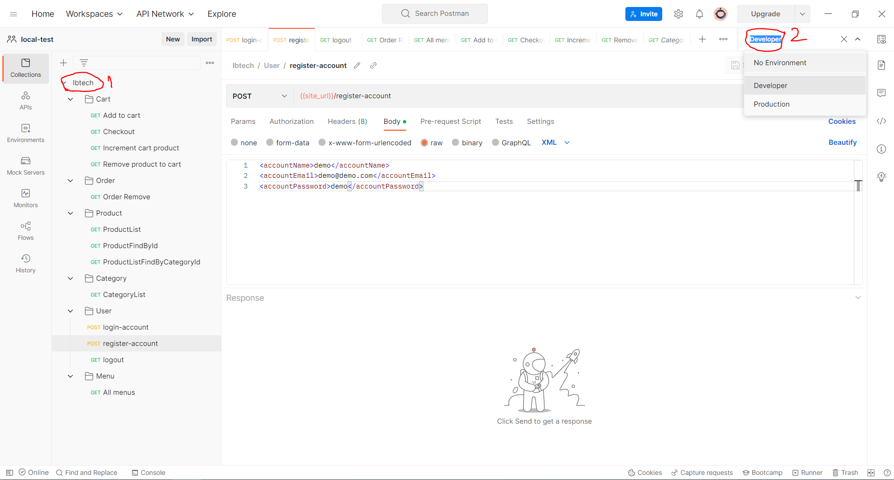

<!-- ROADMAP -->
<h2 id="mail"> :dart: Mail Gönderimi</h2>

 
Projede mail gönderimi için SMTP server kullanılmaktadır. Kullanıcı sisteme yeni kayıt olduğunda
"Hoşgeldin" maili gönderilmektedir. Örnek mail:

  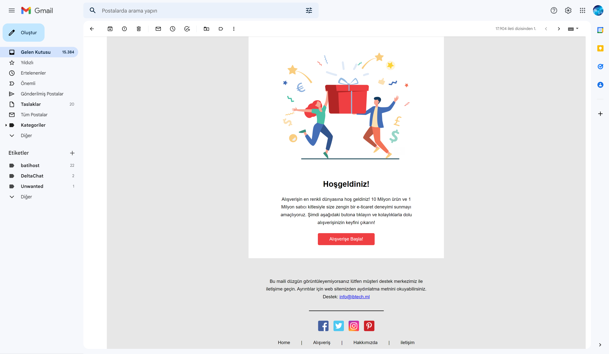

 

<!-- ROADMAP -->
<h2 id="loglama"> :dart: Loglama Ekran Görüntüsü</h2>

 
Projede ayrıntılı log çalışmaları yapılmıştır. Loglama için slf4j paketi kullanılmıştıer.

  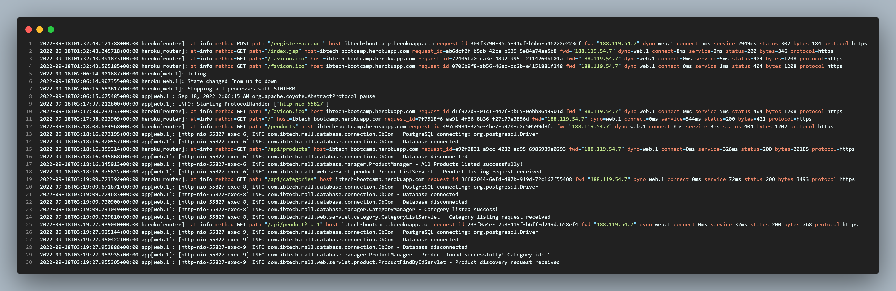

 

<!-- ROADMAP -->
<h2 id="front"> :dart: Frontend Ekran Görüntüsü</h2>

Örnek ekran görüntüleri

Ana sayfa web

  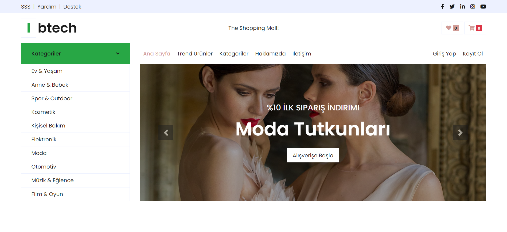

 

Seçilmiş Kategoriler

  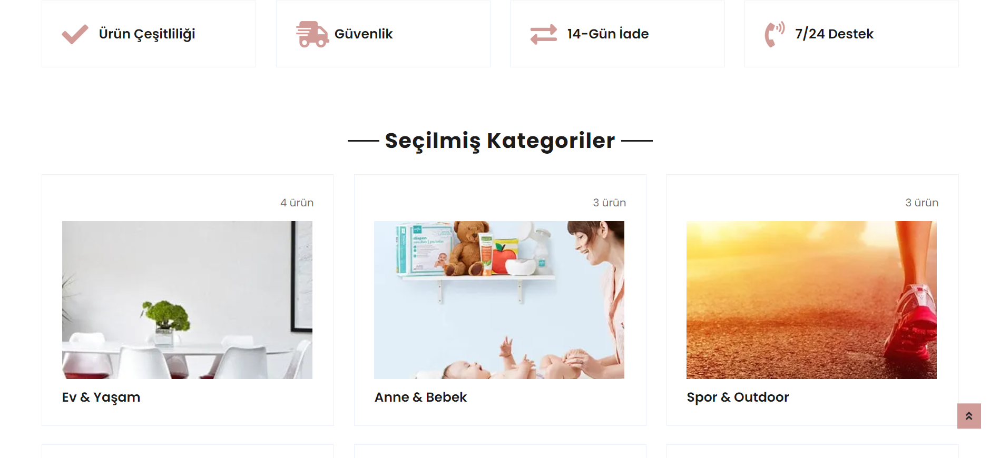

 

Trend Ürünler

  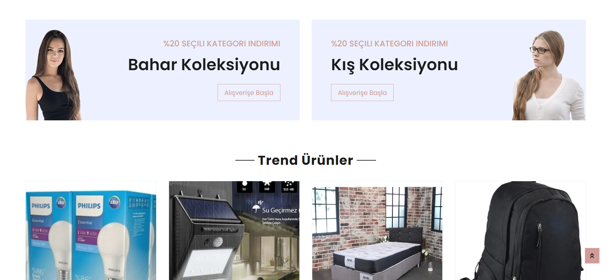

 

Footer

  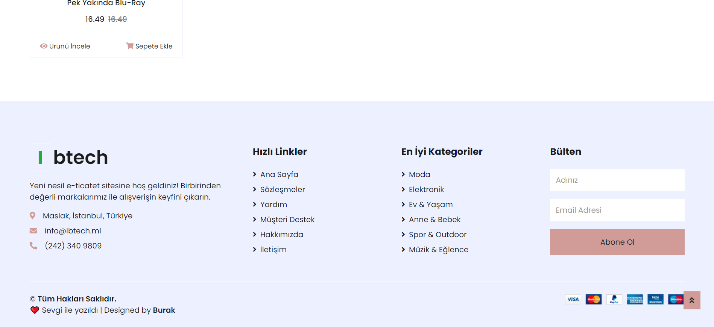

 

Belirli Bir Kategorideki Ürünler

  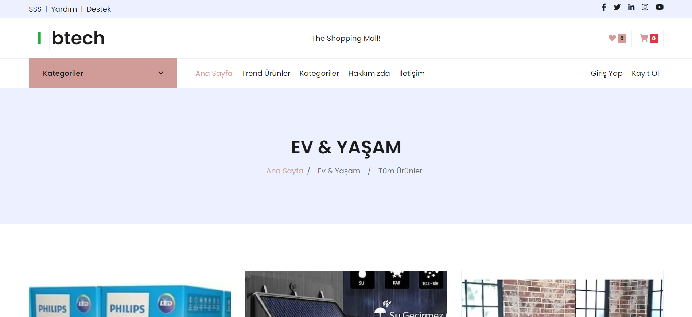

 

Belirli Bir Ürünün Detayı

  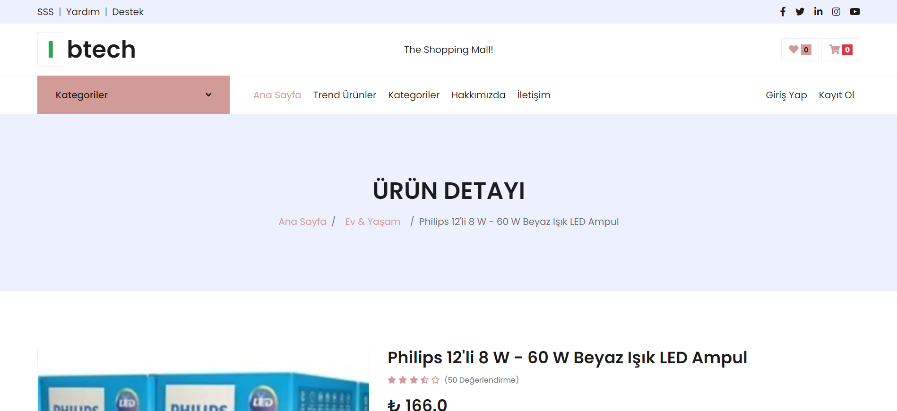

 

Belirli Bir Ürünün Detayı-2

  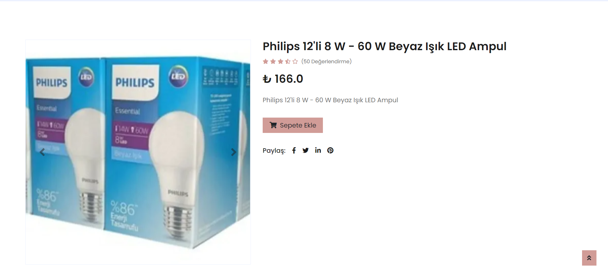

 

Belirli Bir Ürünün Detayı-3

  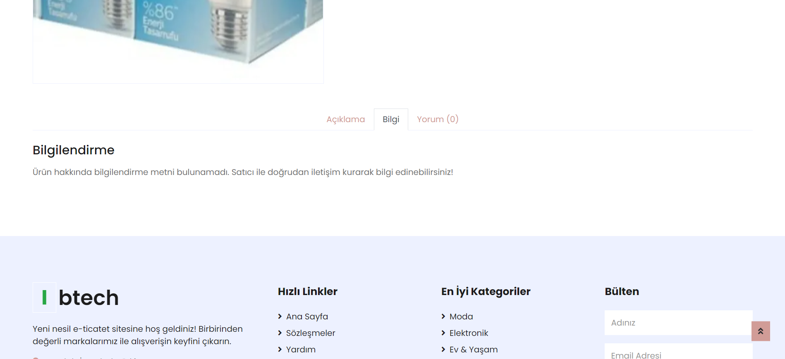

 

Giriş Yap

  

 

Kayıt Ol

  

 

Giriş yapan ve Sepetine Ürün Ekleyen Kullanıcı

  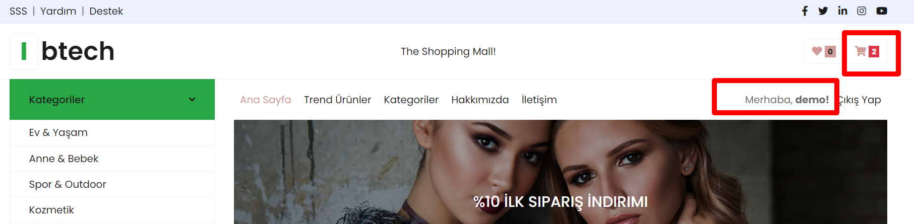

 

Sepet Sayfası

  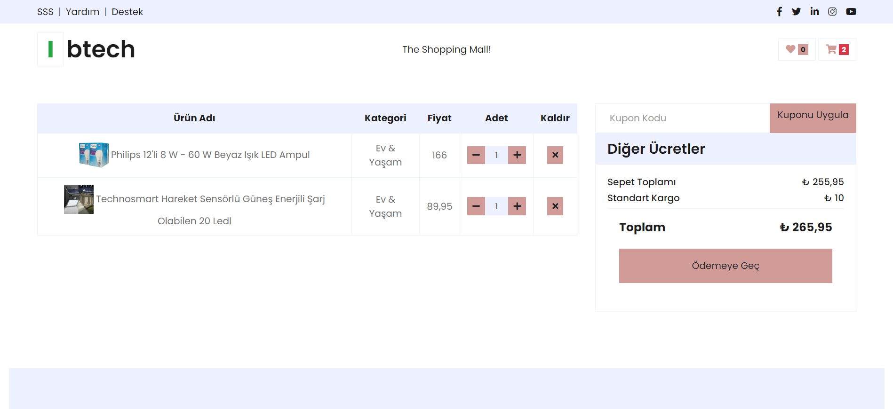

 

Siparişlerim Sayfası

  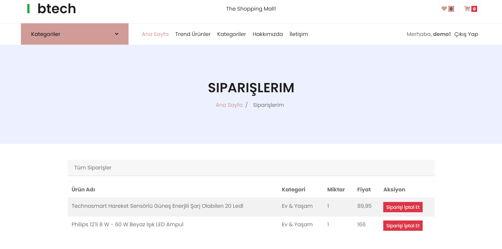

 

Ana Sayfa Mobil Görünüm

  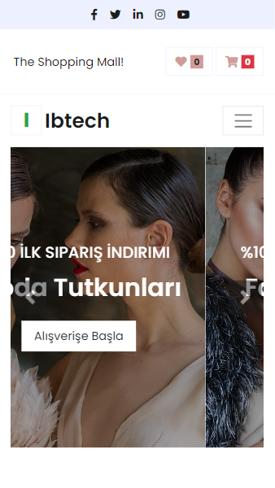

 

Ana Sayfa Mobil Görünüm-2

  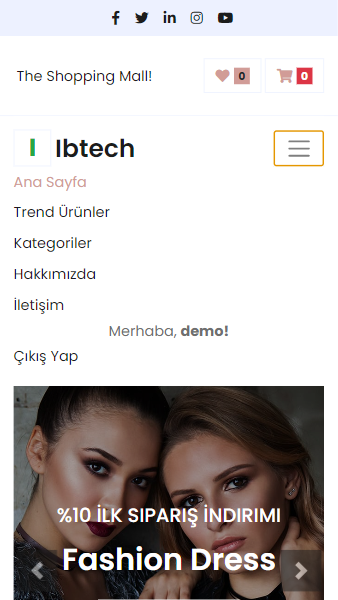

 

<!-- CONTRIBUTORS -->
<h2 id="gelistirme"> :scroll: Bootcamp Hakkında</h2>

  :mortar_board: <i> IBTech Java Developer Bootcamp için hazırlanmıştır. <a href="https://coderspace.io/etkinlikler/ibtech-java-developer-bootcamp/">Coderspace İlan Link</a></i>    
 

<h2 id="iletisim"> :scroll: İletişim ve Bilgiler</h2>

✤ <a href="mailto:burak@yaztem.com">Mail</a>  
✤ <a href="https://linkedin.com/in/byofficial">LinkedIn</a>  
✤ <a href="https://github.com/byofficial">GitHub</a>  
✤ <a href="https://www.youtube.com/channel/UCS4zK06kG5KY4Wtl2C9m5bg">YouTube</a>  
✤ <a href="https://www.udemy.com/user/burak-yildiz-120/">Udemy</a>  
✤ <a href="https://bit.ly/py390">Python Projeler ve Popüler Kütüphaneler Kitabı</a>  